# Pi Zero 2 W + ReSpeaker Wyoming Satellite

Turn a Raspberry Pi Zero 2 WH + ReSpeaker 2-Mics Pi HAT (v1.2/1.3) into a Home Assistant voice satellite.

## Prerequisites

- **Pi Zero 2 WH** with Raspberry Pi OS Lite **64-bit** (Bookworm) flashed, SSH + WiFi configured
- **ReSpeaker 2-Mics Pi HAT** (v1.2 or v1.3, WM8960 codec) attached
- **Speaker** connected to the ReSpeaker HAT's 3.5mm jack or JST connector
- **Home Assistant** with STT, TTS, and a conversation agent already configured
- **openWakeWord add-on** installed on HA (for remote wake word detection)

## Quick Start

SSH into your Pi, then:

```bash
git clone https://github.com/nick-pape/pi-respeaker-wyoming.git
cd pi-respeaker-wyoming

# Edit config as needed
nano config.env

# Run installer (run twice - reboots after driver install)
bash install.sh
```

The installer:
1. Installs system dependencies
2. Clones and builds ReSpeaker audio drivers (~30-60 min, then reboots)
3. **Run `bash install.sh` again after reboot**
4. Sets up wyoming-satellite Python environment
5. Creates and starts systemd services
6. The satellite auto-discovers in Home Assistant

## Wake Word

**Recommended (default): Remote detection** - the HA server runs openWakeWord. The Pi just streams audio. No CPU overhead on the Pi.

Set `WAKE_WORD_MODE="local"` in `config.env` if you want on-device detection, but beware: the Pi Zero 2 W's quad-core 1GHz / 512MB RAM is marginal. Community reports freezes after 4-6 hours.

### Using "Alfred" as a Wake Word

"Alfred" is available as a [community-trained model](https://github.com/fwartner/home-assistant-wakewords-collection). Download the `.tflite` file and either:
- **Remote mode**: Place it in your HA's `/share/openwakeword/` directory
- **Local mode**: Place it in `~/custom-wake-words/` on the Pi and set `WAKE_WORD_NAME="alfred"` in `config.env`

### Training a Custom Wake Word

Use the [openWakeWord Google Colab notebook](https://colab.research.google.com/drive/1q1oe2zOyZp7UsB3jJiQ1IFn8z5YfjwEb) - takes ~30-60 min, no ML experience needed. Produces a `.tflite` file you deploy the same way.

## Managing Services

```bash
# Status
sudo systemctl status wyoming-satellite

# Logs (live)
journalctl -u wyoming-satellite -f

# Restart
sudo systemctl restart wyoming-satellite

# All services
sudo systemctl status wyoming-satellite wyoming-openwakeword 2mic-leds
```

## Troubleshooting

**No audio device after reboot?** Re-run `sudo bash ~/wyoming-satellite/etc/install-respeaker-drivers.sh` and reboot.

**Satellite not discovered in HA?** Add manually: Settings > Devices & Services > Add Integration > Wyoming Protocol > enter Pi's IP and port 10700.

**Kernel update broke drivers?** The DKMS module may fail to rebuild. Re-run the driver install script and reboot.

**Freezes with local wake word?** Switch to `WAKE_WORD_MODE="remote"` in config.env, then re-run `bash install.sh`.

## Architecture

```mermaid
graph LR
    subgraph Pi Zero 2 WH
        HAT[ReSpeaker HAT]
        SAT[wyoming-satellite]
        LED[2mic LED service]
        HAT -- audio --> SAT
        SAT -- events --> LED
    end

    subgraph Home Assistant Server
        OWW[openWakeWord add-on]
        STT[Whisper STT]
        CONV[Conversation Agent]
        TTS[Piper TTS]
        OWW --> STT --> CONV --> TTS
    end

    SAT -- "TCP:10700 · Wyoming Protocol" --> OWW
    TTS -- audio response --> SAT
```



## Note

The `wyoming-satellite` project was archived Jan 2026 in favor of [linux-voice-assistant](https://github.com/OHF-Voice/linux-voice-assistant). The code still works. If starting fresh and feeling adventurous, consider the successor.
